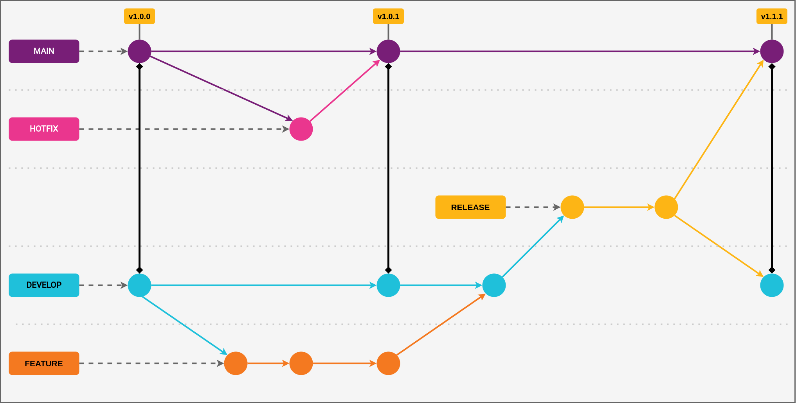

# Contribuindo

Ao contribuir para este repositório, primeiro discuta a alteração que deseja fazer por meio de [_issue_](https://github.com/padupe/treinamento-git/issues), email, ou qualquer outro método com os responsáveis por este projeto antes de fazer uma alteração.

Observe que temos um **Código de Conduta**, siga-o em todas as suas interações com o projeto.

---

## Índice

- [Git Flow](#git-flow)
  - [Diretrizes gerais](#diretrizes-gerais)
  - [Hotfix](#hotfix)
  - [Fluxo do Git Flow](#fluxo-do-git-flow)
- [Padrão de _branches_](#padrão-de-branches)
- [Padrão de _commits_](#padrão-de-commits)
- [Padrão de nomenclaturas](#padrão-de-nomenclaturas)
  - [Arquivos e pastas](#arquivos-e-pastas)
    - [Backend](#backend)
    - [Frontend](#frontend)
  - [Classes, componentes, constantes e funções](#classes-componentes-constantes-e-funções)
- [_Template_ para _Pull Request_](#template-para-pull-request)
- [_Code Review_](#code-review)

---

## Git Flow

Seguimos o fluxo de trabalho de desenvolvimento em equipe, denominado **Git Flow**. Nesta seção indicamos orientações para garantir a "integridade" deste fluxo.

### Diretrizes gerais

Para desenvolvimento de novas _features_ ou correções **NÃO EMERGENCIAIS** sejam realizadas, o fluxo é o apresentado a seguir:

> Este fluxo é o mais comum.

- 1 - Novas _branches_ devem "nascer" a partir da `develop`;

- 2 - Após concluído o desenvolvimento, registrar _Pull Request_ para a _branch_ `develop`;

- 3 - Após o _merge_, sua implementação será validada no ambiente de desenvolvimento;

- 4 - Se não houver nenhum problema/inconsistência, a nova implementação será "promovida" para _release_;

  - 4.1 - Será criada uma nova _branch_ a partir de `develop` com o nome `release/descricao_implementacao`;

- 5 - Será registrado um _Pull Request_ da _branch_ `release/descricao_implementacao` para as _branches_ `main` e `develop`.

### Hotfix

Situações em que são encontradas falhas/inconsistências que exigem uma ação imediata do time de desenvolvimento, o fluxo é o apresentado a seguir:

- 1 - A _branch_ para desenvolvimento da correção "nasce" a partir da `main` com o nome `hotfix/descricao_correcao`;

- 2 - As validações ocorrem na própria _branch_ de `hotfix`;

- 3 - Será registrado um _Pull Request_ da _branch_ `release/descricao_implementacao` para as branchs `main` e `develop`.

### Fluxo do Git Flow

Exemplo visual de fluxo do **Git Flow**:

---

## Padrão de _branches_

Para realizar o desenvolvimento de uma _feature_ ou mesmo um _fix_, orientamos que as _branches_ criadas sigam o seguinte padrão:

- Língua Inglesa;
- Tipo:
  - **_build_**: Alterações que afetam o sistema de compilação do projeto;
  - **_chore_**: Mudanças no projeto que não afetem o sistema ou arquivos de testes. São mudanças de desenvolvimento;
  - **_ci_**: Alterações nos scripts de configuração de CI;
  - **_docs_**: Serão realizadas atualizações ou complementos apenas no contexto de documentações;
  - **_feat_**: Um novo recurso ou funcionalidade será desenvolvida;
  - **_fix_**: Uma correção será realizada;
  - **_perf_**: Alterações no código que melhoram a performance do projeto;
  - **_refactor_**: Altearções no código que alteram sua estrutura, mas não estão relacionadas a correção de _bugs_ ou nova funcionalidades;
  - **_style_**: Alterações que não afetam a lógica de programação do projeto, como remoção de espaços em branco, etc;
  - **_test_**: Adição de novos testes ou de testes ausentes.
- Id da tarefa conforme [_board_](https://dev.azure.com/CSCRZ/tech-hub/_backlogs/backlog/tech-hub%20Team/Backlog%20items);
- Breve resumo do que será desenvolvido/corrigido na _branch_.

**Exemplo:** `feat/7995_front-end`

---

## Padrão de _commits_

Seguimos o [Conventional Commits](https://www.conventionalcommits.org/en/v1.0.0/), que em resumos segue os mesmos princípios destacados na [seção anterior](#padrão-de-branches). O acréscimo, é que devemos informar o contexto em que foi realizado o _commit_. A seguir, maiores detalhes sobre a estrutura básica para _commits_:

- Língua Inglesa;
- Tipo (_build_, _chore_, _ci_, _docs_, _feat_, _fix_, _perf_, _refactor_, _style_ ou _test_);
- Contexto;
  - Indicando o _path_ ("caminho") do arquivo adicionado ou atualizado;
- Mensagem do _commit_.

**Exemplo:** `"docs(README.md): project documentation update."`

---

## Padrão de nomenclaturas

Nesta seção destacamos orientações para nomenclaturas de [**"arquivos e pastas"**](#arquivos-e-pastas), [**"classes, componentes, constantes e funções"**](#classes-componentes-constantes-e-funções). Destaca-se que para **todas as situações**, deve-se adotar a língua inglesa para a nomenclatura.

### Arquivos e pastas

#### Backend

Os arquivos e pastas devem seguir o padrão **Kebab Case**. Ou seja, as palavras são separadas por hífen (-).

Exemplos:

| O que | Exemplo |
| :--: | :--: |
| arquivo | `app.ts` |
| pasta | `directory-example` |

#### Frontend

No caso de pastas e arquivos referentes a componentes [React](https://react.dev/), o padrão recomendado é o **Pascal Case**. Ou seja, é o padrão em que são combinadas palavras colocando todas com a primeira letra maiúscula.

Exemplos:

| O que | Exemplo |
| :--: | :--: |
| arquivo | `ButtonApproveRDM.tsx` |
| pasta | `ButtonApproveRDM` |

### Classes, componentes, constantes e funções

A seguir orientações para a nomenclatura de **classes**, **componentes**, **constantes** e **funções**: 

Exemplos:

| O que | Padrão | Descrição | Exemplo |
| :---: | :---: | :---: | :---: |
| classes | **Pascal Case** | Combina palavras colocando todas com a primeira letra maiúscula. | `GitHubRepository` |
| componentes | **Pascal Case** | Combina palavras colocando todas com a primeira letra maiúscula. | `ButtonApproveRDM` |
| constantes e variáveis | **camelCase** | Deve começar com a primeira letra minúscula e a primeira letra de cada nova palavra subsequente maiúscula. | `responseData` |
| funções | **camelCase** | Deve começar com a primeira letra minúscula e a primeira letra de cada nova palavra subsequente maiúscula. | `getUser` |

**IMPORTANTE**: _Interfaces_ seguem o padrão **Pascal Case** (Combina palavras colocando todas com a primeira letra maiúscula.). A "diferença", é que possuem o nome iniciado com a letra "I". Por exemplo: `IGitHubRepository`.

---

## _Template_ para _Pull Request_

Criamos um _Template_ para facilitar a criação de _Pull Request_ no Projeto. Basta seguir os passos e descrever as alteraçṍes realizadas, desta maneira garantimos que as informações sejam suficientes para que os aprovadores realizem a análise do código.

---

## _Code Review_

Prática visando a **Qualidade** e **Integridade** do código adota neste Projeto.

Assim sendo, toda _Pull Request_ será revisada por, ao menos, um membro do time.